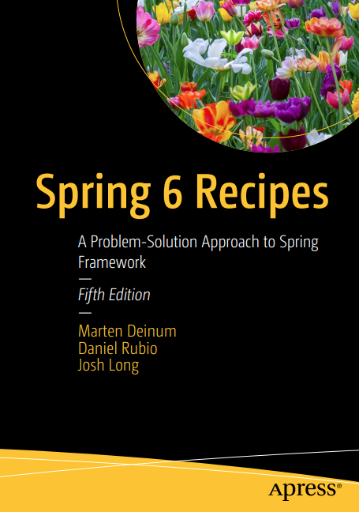

## 개요   

이 레파지토리는 도서 [*Spring 6 Recipes*] 에 나온 예제에 대한 환경 구축 및 실행 가이드를 제공합니다.

저자 : Marten Deinum, Daniel Rubio, and Josh Long  
번역 : LENA  
출판 : 2023

## Release

Release v1.0은 레시피(책)의 이해를 돕기위해 원본 레파지토리(https://github.com/Apress/spring-6-recipes) 에서 업데이트 된 소스코드를 제공합니다.

## Contribution

본 레파지토리의 기여 방법은 [Contributing.md](Contributing.md)를 참고하세요.

## 사전 준비

1. Java19 설치
2. https://gradle.org [Gradle] 설치(또는 프로젝트와 함께 제공된 Gradle Wrapper 사용)
3. IDE설치. IDE별 설치 가이드는 아래의 환경 구축 가이드를 참고하시기 바랍니다. 가이드는 IntelliJ, Eclipse, STS를 제공합니다.
4. (권고)도커 설치.http://docker.com을 사용해 데이터베이스나 샘플 웹 애플리케이션을 실행할 수 있습니다.

## 환경 구축 가이드

- <b>[IntelliJ](build/intellij-guide.md)</b>  
- <b>[Eclipse]()</b>
- <b>[STS]()</b>

## 빌드 방법

메인 디렉터리에서 `./gradlew build` 명령어를 실행하면 모든 의존성이 다운로드되고 레시피가 빌드 됩니다.
